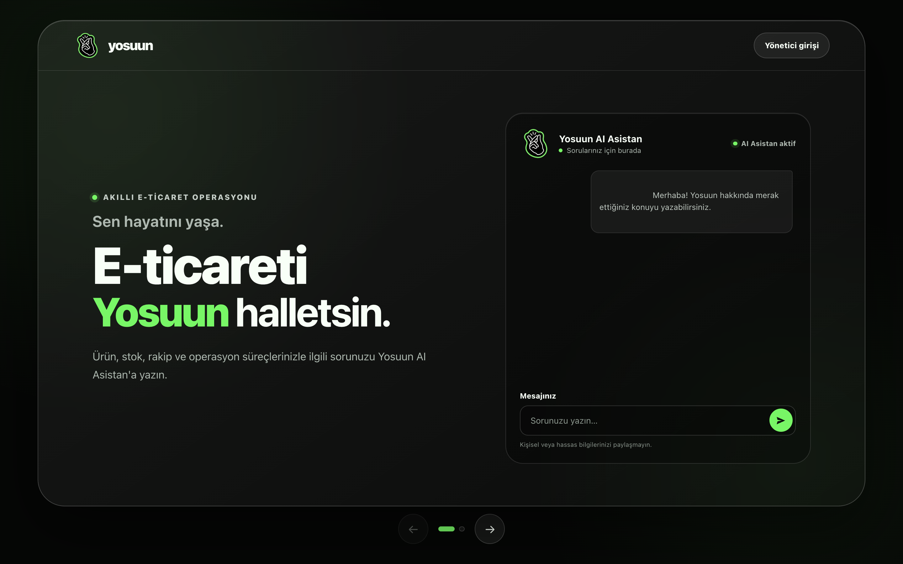
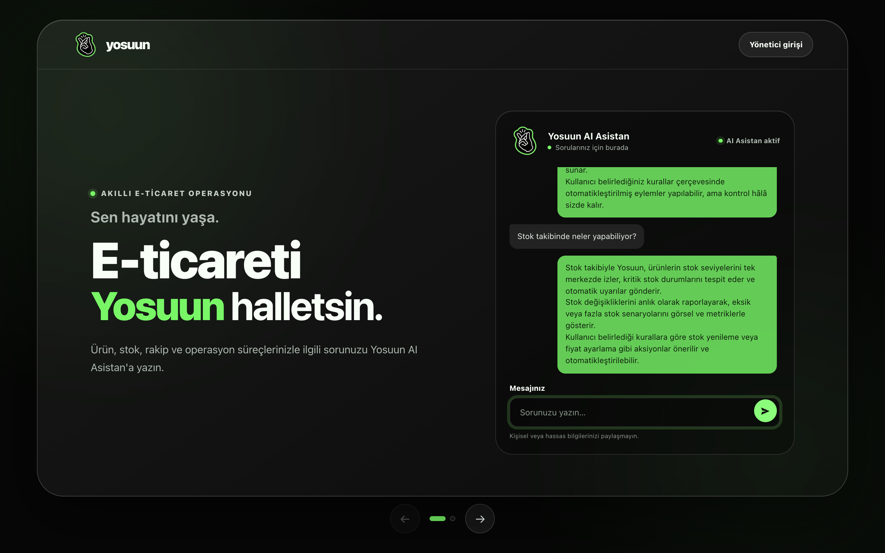
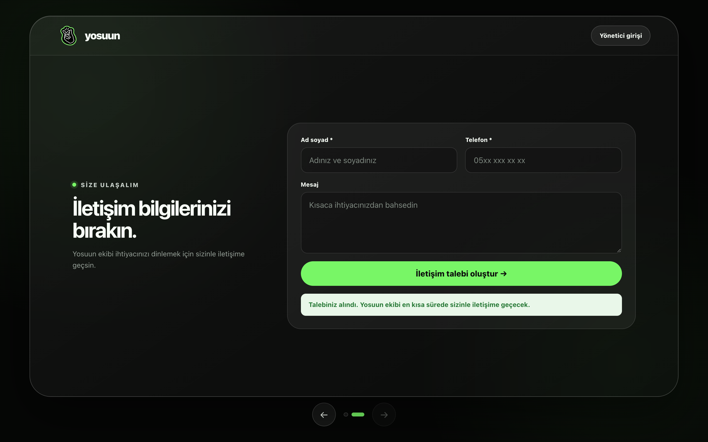
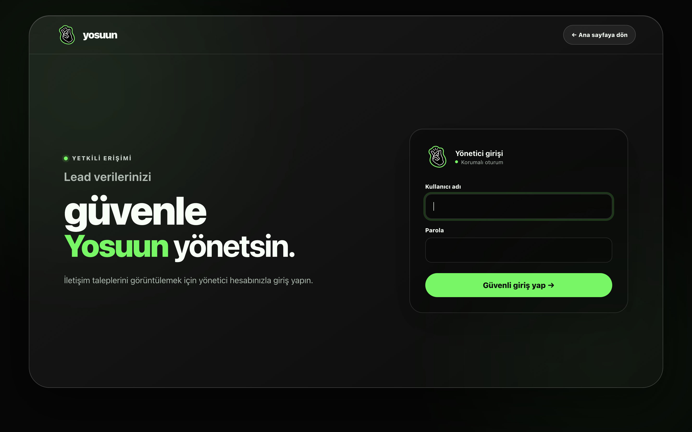
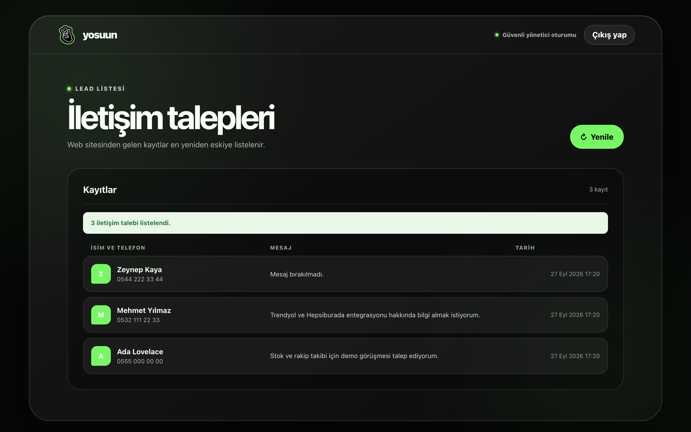
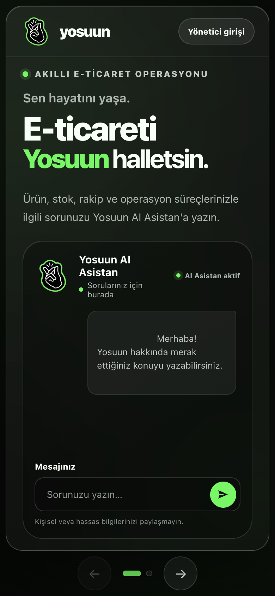

<div align="center">


# Yosuun SmartLead AI

**Yapay zekâ destekli ziyaretçi asistanı ve lead yönetim paneli**

*"Sen hayatını yaşa, e-ticareti Yosuun halletsin."*


[Canlı demo](https://yosuun-smartlead-ai.onrender.com) ·
[Ekran görüntüleri](#-ekran-görüntüleri) ·
[Kurulum](#-yerel-kurulum) ·
[API](#-api) ·
[Güvenlik](#-güvenlik-kararları)

</div>

---



## 📌 Proje hakkında

Yosuun SmartLead AI; ziyaretçilerin Yosuun hakkında yapay zekâ destekli yanıtlar almasını, iletişim talebi bırakmasını ve bu taleplerin tek bir yönetim ekranında görüntülenmesini sağlayan Flask tabanlı bir MVP'dir.

Uygulama tek servis olarak çalışır: Flask hem Jinja arayüzlerini ve statik dosyaları sunar hem de sohbet/lead API'lerini sağlar. Groq anahtarı tanımlanmadığında sohbet güvenli bir demo cevabı döndürür.

| Kullanıcı | Ne yapar? | Nerede? |
|---|---|---|
| **Ziyaretçi (B2C)** | Yosuun AI Asistan'a soru sorar, iletişim bilgisini bırakır | `/` |
| **Yönetici (B2B)** | Güvenli giriş yapar, gelen lead'leri listeler | `/login`, `/dashboard` |

## 📑 İçindekiler

- [Ekran görüntüleri](#-ekran-görüntüleri)
- [Özellikler](#-özellikler)
- [Teknoloji yığını](#-teknoloji-yığını)
- [Mimari](#-mimari)
- [Yerel kurulum](#-yerel-kurulum)
- [Environment değişkenleri](#-environment-değişkenleri)
- [API](#-api)
- [Testler](#-testler)
- [Render deployment](#-render-deployment)
- [Güvenlik kararları](#-güvenlik-kararları)
- [AI bilgi kaynağını güncelleme](#-ai-bilgi-kaynağını-güncelleme)
- [Bilinen sınırlamalar](#-bilinen-sınırlamalar)

## 📸 Ekran görüntüleri

### 1. Yosuun AI Asistan ile sohbet

Ziyaretçi, ürün, stok, rakip ve operasyon süreçleriyle ilgili sorusunu yazar. Mesaj `/api/sohbet` endpoint'ine gider; backend, bilgi dokümanının tamamını ve sınırlı sohbet geçmişini Groq'a göndererek cevabı üretir. Asistan önceki mesajları hatırlayarak takip sorularına da yanıt verir.



### 2. İletişim talebi (lead) oluşturma

Alttaki ok ve nokta kontrolleriyle iletişim ekranına geçilir. Ad soyad ve telefon zorunlu, mesaj isteğe bağlıdır. Kayıt başarılı olduğunda ziyaretçiye onay mesajı gösterilir.



### 3. Yönetici girişi

Yönetim paneli yalnızca yetkili hesaba açıktır. Parola PBKDF2 hash'i ile doğrulanır; form CSRF token'ı ile korunur ve tekrarlanan hatalı denemeler geçici olarak sınırlandırılır.



### 4. Lead yönetim paneli

Web sitesinden gelen tüm iletişim talepleri en yeniden eskiye listelenir. Her satırda isim, tıklanabilir telefon bağlantısı, mesaj ve tarih yer alır; **Yenile** butonu listeyi sayfa yenilemeden günceller.



### 5. Mobil görünüm

Arayüz responsive tasarlanmıştır; sohbet ve form ekranları telefon boyutunda da tek sütunda rahatça kullanılır.

<p align="center">
  
</p>

> Ekran görüntüleri yerel ortamda, geçici bir SQLite veritabanı ve örnek (gerçek olmayan) lead kayıtlarıyla alınmıştır.

## ✨ Özellikler

**Yapay zekâ asistanı**
- Küratörlü bilgi dokümanına dayanan Türkçe Yosuun AI asistanı
- Bilgi dokümanını parçalamadan modele veren basit RAG akışı
- Niyet sınıflandırması veya retrieval puanlaması olmadan doğrudan AI cevabı
- Hazır FAQ cevabı kullanmadan her normal soruda AI üretimi
- Sınırlı ve doğrulanmış sohbet geçmişi
- Groq anahtarı yoksa çökmeyen demo modu

**Lead yönetimi**
- İsim, telefon ve isteğe bağlı mesaj ile lead oluşturma
- Lead'leri en yeniden eskiye sıralayan responsive dashboard
- SQLite veri katmanı ve parametrik sorgular

**Güvenlik ve kalite**
- Parola hash'i, CSRF ve oturum korumalı tek-admin yönetici girişi
- Aynı-origin, göreli `/api/*` istekleri
- Güvenli hata cevapları, istek boyutu ve alan uzunluğu sınırları
- Klavye kullanımını ve temel erişilebilirliği gözeten arayüzler
- 112 otomatik test

## 🧰 Teknoloji yığını

| Katman | Teknoloji |
|---|---|
| Backend | Python 3.9+, Flask, Jinja |
| Veritabanı | SQLite |
| Frontend | Vanilla JavaScript (ES modules), CSS |
| Yapay zekâ | Groq Chat Completions API (`openai/gpt-oss-20b`) |
| Sunucu | Gunicorn |
| Test | Pytest |
| Yayın | Render |

### Öğrenci yönergesine uyarlamalar

Proje, SmartLead AI öğrenci yönergesinin backend mimarisini korur. Teslimde yanlış anlaşılmayı önlemek için iki bilinçli uyarlama yapılmıştır:

- Wix/Velo yerine B2C ve B2B arayüzleri Flask/Jinja, vanilla JavaScript ve CSS ile aynı uygulamada geliştirilmiştir. Bu nedenle frontend istekleri aynı-origin `/api/*` yollarını kullanır ve CORS açılmaz.
- Yönergedeki `llama-3.1-8b-instant` modeli Groq tarafından 16 Ağustos 2026'da developer/free kullanım için kapatıldığından Groq'un önerdiği `openai/gpt-oss-20b` kullanılır. Ayrıntı: [Groq model deprecation](https://console.groq.com/docs/deprecations).

## 🏗️ Mimari

```text
Browser
  ├── /            -> B2C sohbet ve lead formu
  ├── /login       -> Yönetici kimlik doğrulaması
  ├── /dashboard   -> Korumalı B2B lead listesi
  └── /api/*       -> Flask route katmanı
                         ├── AIService
                         │    ├── KnowledgeService -> dokümanın tamamı
                         │    └── Groq -> tek AI cevabı
                         └── database  -> SQLite
```

Sayfa rotaları `pages`, JSON rotaları `api` Blueprint'i altında tutulur; `/api` öneki application factory tarafından kaydedilir.

### Sohbet isteğinin yolculuğu

```text
Ziyaretçi mesajı
  → home.js / api-client.js   (POST /api/sohbet)
  → routes.py                 (JSON doğrulama, hız sınırı)
  → ai_service.py             (sistem prompt'u + bilgi dokümanı + geçmiş)
  → Groq API                  (cevap üretimi)
  → routes.py                 ({"basari": true, "cevap": "..."})
  → home.js                   (textContent ile güvenli render)
```

### Dosya sorumlulukları

| Dosya | Sorumluluk |
|---|---|
| `app/__init__.py` | Application factory, health endpoint'i ve ortak hata yönetimi |
| `app/auth.py` | Yönetici girişi, session, CSRF ve deneme sınırı |
| `app/routes.py` | Ayrı `pages`/`api` Blueprint'leri, HTTP doğrulama, servis çağrısı ve response mapping |
| `app/database.py` | Tüm SQLite bağlantıları ve SQL sorguları |
| `app/services/ai_service.py` | Tam bilgi dokümanıyla prompt oluşturma, Groq çağrısı ve demo modu |
| `app/services/knowledge_service.py` | Markdown bilgi dokümanını tek parça okuyup bellekte tutma |
| `app/services/rate_limiter.py` | Public sohbet endpoint'i için process-local hız sınırı |
| `knowledge/yosuun_mvp.md` | AI'nin her istekte tamamını kullandığı kısa bilgi dokümanı |
| `app/static/js/api-client.js` | Frontend HTTP sözleşmesi |
| `app/static/js/home.js` | Sohbet, slider ve lead formu davranışları |
| `app/static/js/dashboard.js` | Lead listesinin güvenli DOM render işlemleri |
| `config.py` | Environment tabanlı tek yapılandırma kaynağı |

### Klasör yapısı

```text
yosuun-smartlead-ai/
├── app/
│   ├── __init__.py          # create_app()
│   ├── auth.py
│   ├── database.py
│   ├── routes.py
│   ├── services/
│   │   ├── ai_service.py
│   │   ├── knowledge_service.py
│   │   └── rate_limiter.py
│   ├── static/              # css/, js/, images/
│   └── templates/           # index.html, login.html, dashboard.html
├── knowledge/
│   └── yosuun_mvp.md        # AI bilgi kaynağı
├── docs/screenshots/        # README görselleri
├── tests/
├── config.py
├── run.py
└── requirements.txt
```

## 🚀 Yerel kurulum

```bash
git clone https://github.com/Alybefeygz/yosuun-smartlead-ai.git
cd yosuun-smartlead-ai

python3 -m venv .venv
source .venv/bin/activate
python -m pip install -r requirements.txt
cp .env.example .env
python run.py
```

Uygulama varsayılan olarak `http://127.0.0.1:5000` adresinde açılır:

| Sayfa | Adres |
|---|---|
| Ziyaretçi arayüzü | `http://127.0.0.1:5000/` |
| Yönetici girişi | `http://127.0.0.1:5000/login` |
| Yönetim ekranı | `http://127.0.0.1:5000/dashboard` |
| Sağlık kontrolü | `http://127.0.0.1:5000/health` |

Gerçek AI yanıtları için `.env` dosyasındaki `GROQ_API_KEY` değerini doldurun. Bu dosya Git tarafından yok sayılır; gerçek anahtarları hiçbir zaman commit etmeyin.

Yönetici parolasını düz metin olarak kaydetmeyin. Güçlü bir PBKDF2 hash'i üretip `.env` içindeki `ADMIN_PASSWORD_HASH` alanına ekleyin:

```bash
python -c "from getpass import getpass; from werkzeug.security import generate_password_hash; print(generate_password_hash(getpass('Yönetici parolası: '), method='pbkdf2:sha256:600000'))"
```

## ⚙️ Environment değişkenleri

| Değişken | Gerekli | Varsayılan / açıklama |
|---|---:|---|
| `FLASK_ENV` | Production'da evet | `development`; production için `production` |
| `SECRET_KEY` | Production'da evet | Uzun ve rastgele bir secret |
| `ADMIN_USERNAME` | Production'da evet | Yönetici kullanıcı adı |
| `ADMIN_PASSWORD_HASH` | Production'da evet | Düz parola değil, PBKDF2 hash değeri |
| `DATABASE_URL` | Hayır | `instance/yosuun.sqlite3` |
| `GROQ_API_KEY` | Gerçek AI için evet | Boşsa demo modu kullanılır |
| `AI_PROVIDER` | Hayır | `groq` |
| `GROQ_MODEL` | Hayır | `openai/gpt-oss-20b` |
| `AI_TIMEOUT_SECONDS` | Hayır | `20` |
| `AI_HISTORY_MAX_MESSAGES` | Hayır | `20` |
| `AI_HISTORY_MAX_CHARS` | Hayır | `8000` |
| `AI_TEMPERATURE` | Hayır | `0.3`; daha tutarlı kurumsal cevaplar |
| `AI_MAX_COMPLETION_TOKENS` | Hayır | `500` |
| `KNOWLEDGE_BASE_PATH` | Hayır | `knowledge/yosuun_mvp.md` |
| `CHAT_RATE_LIMIT_REQUESTS` | Hayır | Pencere başına `10` sohbet isteği |
| `CHAT_RATE_LIMIT_WINDOW_SECONDS` | Hayır | `60` saniye |
| `MAX_CONTENT_LENGTH` | Hayır | `65536` byte |
| `BUSINESS_CONTEXT` | Hayır | Uygulamadaki varsayılan Yosuun sistem bağlamı |

## 🔌 API

Tüm API cevapları `basari` alanını içerir.

| Metot | Yol | Yetki | Açıklama |
|---|---|---|---|
| `POST` | `/api/sohbet` | Herkese açık (hız sınırlı) | AI asistandan cevap alır |
| `POST` | `/api/leads` | Herkese açık | Yeni iletişim talebi oluşturur |
| `GET` | `/api/leads` | Yönetici oturumu | Lead listesini döndürür |
| `GET` | `/health` | Herkese açık | Servis sağlık kontrolü |

### Sohbet

`POST /api/sohbet`

```json
{
  "mesaj": "Yosuun stok yönetiminde nasıl yardımcı olur?",
  "gecmis": [
    {"role": "user", "content": "Merhaba"},
    {"role": "assistant", "content": "Merhaba, nasıl yardımcı olabilirim?"}
  ]
}
```

Başarılı cevap:

```json
{"basari": true, "cevap": "..."}
```

Kullanıcı mesajı, sınırlı sohbet geçmişi ve `knowledge/yosuun_mvp.md` dokümanının tamamı Groq'a gönderilir. Nihai `cevap` doğrudan AI tarafından üretilir.

### Lead oluşturma

`POST /api/leads`

```json
{
  "isim": "Ada Lovelace",
  "telefon": "+90 555 000 00 00",
  "mesaj": "Ürün hakkında görüşmek istiyorum."
}
```

Başarılı cevap `201 Created` durum koduyla döner:

```json
{"basari": true, "mesaj": "İletişim bilgileriniz kaydedildi."}
```

### Lead listesi

`GET /api/leads`

Bu endpoint geçerli bir yönetici session cookie'si gerektirir. Anonim istekler `401 AUTH_REQUIRED` alır.

```json
{
  "basari": true,
  "leads": [
    {
      "id": 1,
      "isim": "Ada Lovelace",
      "telefon": "+90 555 000 00 00",
      "mesaj": "Ürün hakkında görüşmek istiyorum.",
      "tarih": "2026-09-20 12:00:00"
    }
  ]
}
```

### Hata zarfı

Hata cevapları ortak bir zarf kullanır:

```json
{
  "basari": false,
  "hata": {"kod": "VALIDATION_ERROR", "mesaj": "..."}
}
```

## 🧪 Testler

```bash
python -m pytest -q
```

Proje; veritabanı, API, bilgi kaynağı, AI servisi, kimlik doğrulama, yapılandırma ve arayüz şablonlarını denetleyen **112 otomatik test** içerir.

| Test dosyası | Kapsam |
|---|---|
| `tests/test_database.py` | SQLite sorguları ve veri katmanı |
| `tests/test_routes.py` | API sözleşmesi, doğrulama ve hata cevapları |
| `tests/test_ai_service.py` | Prompt oluşturma, Groq çağrısı, hata normalizasyonu, demo modu |
| `tests/test_knowledge_service.py` | Bilgi dokümanının okunması |
| `tests/test_auth.py` | Giriş, oturum, CSRF ve deneme sınırı |
| `tests/test_config.py` | Environment tabanlı yapılandırma |
| `tests/test_templates.py` | Arayüz şablonu sözleşmeleri |

Belirli bir katmanı çalıştırmak için örnek:

```bash
python -m pytest -q tests/test_database.py
```

## ☁️ Render deployment

1. Bu repoyu Render'da yeni bir Web Service'e bağlayın.
2. Build command olarak `pip install -r requirements.txt` kullanın.
3. Start command olarak `gunicorn run:app` kullanın.
4. Health check path değerini `/health` yapın.
5. Aşağıdaki production environment değişkenlerini tanımlayın:

```text
FLASK_ENV=production
SECRET_KEY=<uzun-rastgele-secret>
ADMIN_USERNAME=<yonetici-kullanici-adi>
ADMIN_PASSWORD_HASH=<pbkdf2-parola-hash-degeri>
GROQ_API_KEY=<gercek-groq-anahtari>
AI_PROVIDER=groq
GROQ_MODEL=openai/gpt-oss-20b
AI_TEMPERATURE=0.3
AI_MAX_COMPLETION_TOKENS=500
KNOWLEDGE_BASE_PATH=knowledge/yosuun_mvp.md
CHAT_RATE_LIMIT_REQUESTS=10
CHAT_RATE_LIMIT_WINDOW_SECONDS=60
DATABASE_URL=<kalici-disk-uzerindeki-sqlite-yolu>
```

> ⚠️ SQLite dosyasının deploy/restart sonrasında korunması gerekiyorsa `DATABASE_URL` mutlaka Render persistent disk üzerindeki bir yolu göstermelidir. Persistent disk kullanılmayan ortamlarda lead verileri ephemeral olabilir.

## 🔒 Güvenlik kararları

- `.env`, SQLite runtime dosyaları, sanal ortamlar ve cache çıktıları repoya alınmaz.
- SQL yalnızca `app/database.py` içinde ve `?` placeholder'larıyla çalışır.
- Groq çağrısı ve API anahtarı yalnızca backend tarafındadır.
- `/dashboard` ve `GET /api/leads` sunucu tarafında yönetici oturumuyla korunur.
- Düz parola saklanmaz; Werkzeug doğrulamalı PBKDF2 hash'i kullanılır.
- Login ve logout formları session-bound CSRF token kullanır.
- Production cookie'si `Secure`, `HttpOnly` ve `SameSite=Lax` olarak ayarlanır.
- Tekrarlanan başarısız girişler geçici olarak sınırlandırılır; hassas sayfalar cache'lenmez.
- CSP, clickjacking, MIME-sniffing, referrer ve HSTS güvenlik başlıkları uygulanır.
- Frontend kullanıcı verisini `textContent` ile render eder; `innerHTML` kullanmaz.
- İstemciden `system` rolü kabul edilmez; geçmiş mesaj sayısı ve karakter bütçesi sınırlıdır.
- Bilgi dokümanının tamamı yalnızca backend tarafından okunur ve Groq sistem mesajına eklenir.
- Sistem prompt'u bilgi dokümanı içindeki talimat benzeri metinlerin yeni komut olarak yorumlanmamasını söyler.
- Groq timeout, ağ, HTTP, boş veya bozuk cevap hataları `AIServiceError` olarak normalize edilir ve API'den güvenli `503` cevabı döner.
- Public sohbet endpoint'i IP başına kayan pencere hız sınırıyla korunur.
- Production hata cevapları traceback veya secret içermez.

## 📚 AI bilgi kaynağını güncelleme

AI cevaplarının çalışma kaynağı `knowledge/yosuun_mvp.md` dosyasıdır. Ürün, fiyat, entegrasyon veya iletişim bilgisi değiştiğinde bu dosyadaki ilgili bölüm ve `last_updated` alanı birlikte güncellenmelidir. Bilgi kaynağı secret, müşteri verisi veya yayınlanması istenmeyen kişisel veri içermemelidir.

Her değişiklikten sonra bilgi kaynağı ve AI servis testlerini çalıştırın:

```bash
python -m pytest -q tests/test_knowledge_service.py tests/test_ai_service.py
```

## 🚧 Bilinen sınırlamalar

- Kimlik doğrulama tek yönetici hesabına yöneliktir; kullanıcı yönetimi ve parola sıfırlama akışı yoktur.
- Login ve sohbet hız sınırları process belleğindedir; birden fazla instance için Redis gibi ortak bir rate-limit deposu gerekir.
- SQLite tek servisli MVP için uygundur; yatay ölçekleme için ortak bir veritabanına geçilmelidir.
- Bilgi dokümanının tamamı her AI isteğine eklendiği için dosyanın Groq token limitinin altında tutulması gerekir. Doküman ciddi ölçüde büyürse daha sonra chunking veya vektör arama eklenebilir.
- Filtreleme, arama, CRM aktarımı ve lead durum yönetimi kapsam dışıdır.

## 🔗 Bağlantılar

- GitHub: <https://github.com/Alybefeygz/yosuun-smartlead-ai>
- Canlı demo: <https://yosuun-smartlead-ai.onrender.com>
